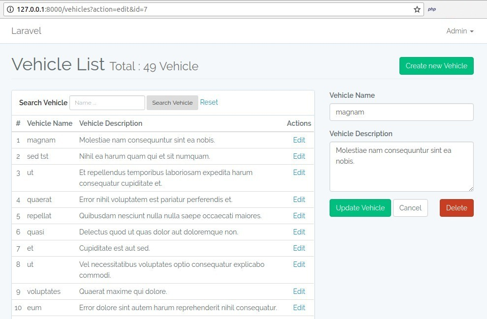

# Laravel Simple CRUD Generator
[](https://travis-ci.org/nafiesl/SimpleCrudGenerator)

An artisan `make:crud` command to create a simple CRUD feature on your Laravel 5.3, 5.4, and 5.5 application.

## About this package
With this package installed on local environment, we can use (e.g.) `php artisan make:crud Vehicle` command to generate some files :
- `App\Vehicle.php` eloquent model
- `xxx_create_vehicles_table.php` migration file
- `VehiclesController.php`
- `index.blade.php` and `forms.blade.php` view file in `resources/views/vehicles` directory
- `resources/lang/vehicle.php` lang file
- `VehicleFactory.php` model factory file
- `VehiclePolicy.php` model policy file in `app/Policies` directory
- `ManageVehiclesTest.php` feature test class in `tests/Feature` directory
- `VehicleTest.php` unit test class in `tests/Unit/Models` directory
- `VehiclePolicyTest.php` unit test class in `tests/Unit/Policies` directory

It will update some file :
- Update `routes/web.php` to add `vehicles` resource route
- Update `app/providers/AuthServiceProvider.php` to add Vehicle model Policy class in `$policies` property

It will also create this file **if it not exists** :
- `resources/lang/app.php` lang file if it not exists
- `tests/BrowserKitTest.php` base Feature TestCase class if it not exists

#### Main purpose

The main purpose of this package is for faster **Test-driven Development**, it generates model CRUD scaffolds complete with Testing Classes which will use [Laravel Browserkit Testing](https://github.com/laravel/browser-kit-testing) package and [PHPUnit](https://packagist.org/packages/phpunit/phpunit) version 6.

#### Model Attribute/column

The Model and table will **only have 2** pre-definded attributes or columns : **name** and **description** on each generated model and database table. You can continue working on other column on the table.

## How to install

```bash
# Bootstrap Form Field generator
$ composer require luthfi/formfield

# Get the package
$ composer require luthfi/simple-crud-generator --dev
```

> For Laravel 5.5, the package will **auto-discovered** and ready to go.

#### For Laravel 5.3 and 5.4

Update `config/app.php`, add provider and aliases :

```php
// providers
Luthfi\FormField\FormFieldServiceProvider::class,
Luthfi\CrudGenerator\ServiceProvider::class,

// aliases
'FormField' => Luthfi\FormField\FormFieldFacade::class,
'Form'      => Collective\Html\FormFacade::class,
'Html'      => Collective\Html\HtmlFacade::class,
```

## How to use
Just type in terminal `$ php artisan` and we will find the `make:crud` command, it will create simple Laravel CRUD files of given **model name**.

```bash
# For example we want to create CRUD for 'App\Vehicle' model.

$ php artisan make:crud Vehicle

Vehicle resource route generated on routes/web.php.
Vehicle model generated.
Vehicle table migration generated.
VehiclesController generated.
Vehicle index view file generated.
Vehicle form view file generated.
lang/app.php generated.
vehicle lang files generated.
Vehicle model factory generated.
Vehicle model policy generated.
AuthServiceProvider class has been updated.
BrowserKitTest generated.
ManageVehiclesTest generated.
VehicleTest (model) generated.
VehiclePolicyTest (model policy) generated.
CRUD files generated successfully!
```

Make sure we have set our database credential on `.env` file. Then :

```bash
$ php artisan migrate
$ php artisan serve
```

Then visit our application url: `http://localhost:8000/vehicles`.

## Config file

By default, this package have some configuration:

```php
<?php

return [
    // The master view layout that generated views will extends
    'default_layout_view' => 'layouts.app',

    // The base test case class path for generated testing classes
    'base_test_path' => 'tests/BrowserKitTest.php',

    // The base test class full name
    'base_test_class' => 'Tests\BrowserKitTest',
];
```

You can configure your own by publishing the config file:

```bash
$ php artisan vendor:publish --provider="Luthfi\CrudGenerator\ServiceProvider"
```

That will generate `config/simple-crud.php` file.

## Attention

- The package will creates the **Model** class file, the command will stop if the **Model already exists**.
- You need a `resources/views/layouts/app.blade.php` view file, simply create one with `php artisan make:auth` command. You can change this configuration via the `config/simple-crud.php` file.

## Screenshots

Visit your application in new resource route : `http://127.0.0.1:8000/vehicles`



### Let's try the generated testing suite

Next, to use the generated testing classes, we can set the database environment using *in-memory* database SQLite. Open `phpunit.xml`. Add two lines below on the `env` :

```xml
<phpunit>
    <!-- ..... -->
    <php>
        <!-- ..... -->
        <env name="DB_CONNECTION" value="sqlite"/>
        <env name="DB_DATABASE" value=":memory:"/>
    </php>
</phpunit>
```

> If you are using Laravel 5.3, you need some [additional configuration](#only-for-laravel-53).

Then run PHPUnit

```bash
$ vendor/bin/phpunit
```

All tests should be passed.


#### ONLY for Laravel 5.3

Before start using the package on Laravel 5.3, we need some configuration to make testing works (since it still has BrowserKit Testing features, we will use existing Laravel BaseTest Class and PHPUnit 5.7).

```bash
$ vendor:publish --provider='Luthfi\CrudGenerator\ServiceProvider'
```

Then on `config/simple-crud.php` edit "base_test_path" and "base_test_class" value:

```php
// config/simple-crud.php

    'base_test_path' => 'tests/TestCase.php',
    'base_test_class' => 'TestCase',
```

Then add **loginAsUser** method on `tests/TestCase.php` file :

```php
<?php

use App\User;

abstract class TestCase extends Illuminate\Foundation\Testing\TestCase
{
    // ... method createApplication()

    protected function loginAsUser()
    {
        $user = factory(User::class)->create();
        $this->actingAs($user);

        return $user;
    }
}
```

Done, you may continue to [try the testing suite](#lets-try-the-generated-testing-suite). Please [let me know](https://github.com/nafiesl/SimpleCrudGenerator/issues/new) if this configuration had **any issue**.

## License

This package is open-sourced software licensed under the [MIT license](LICENSE).
